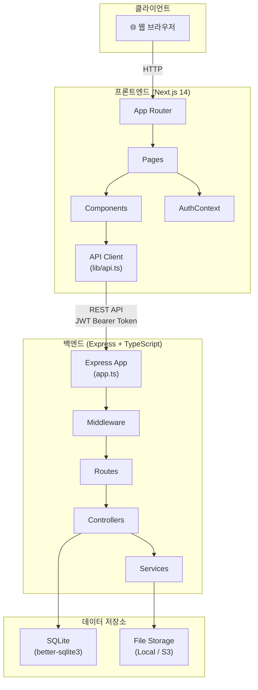
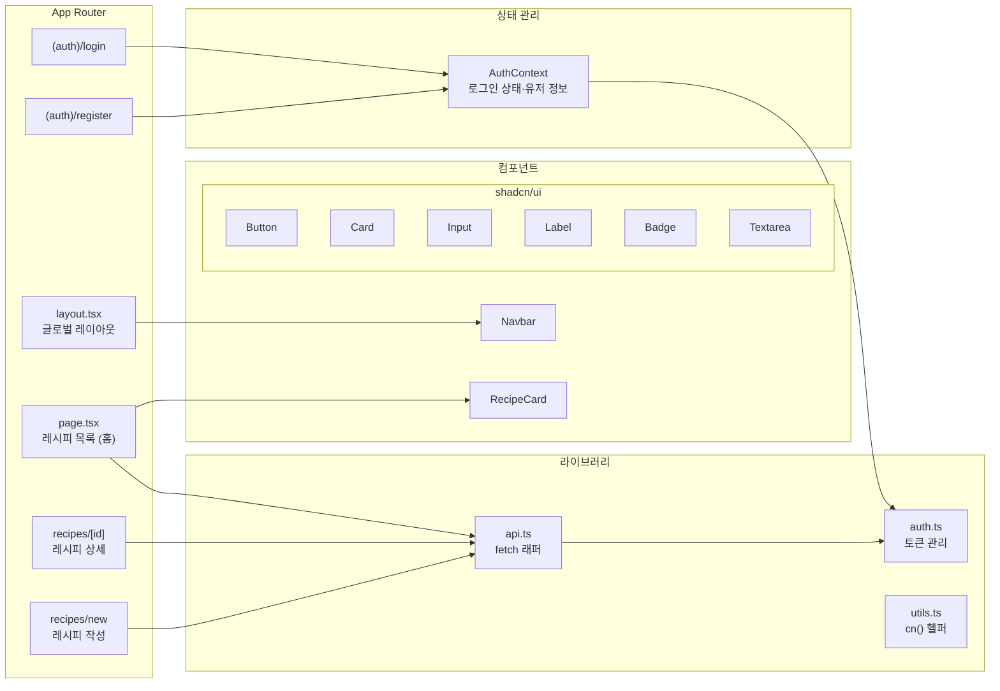
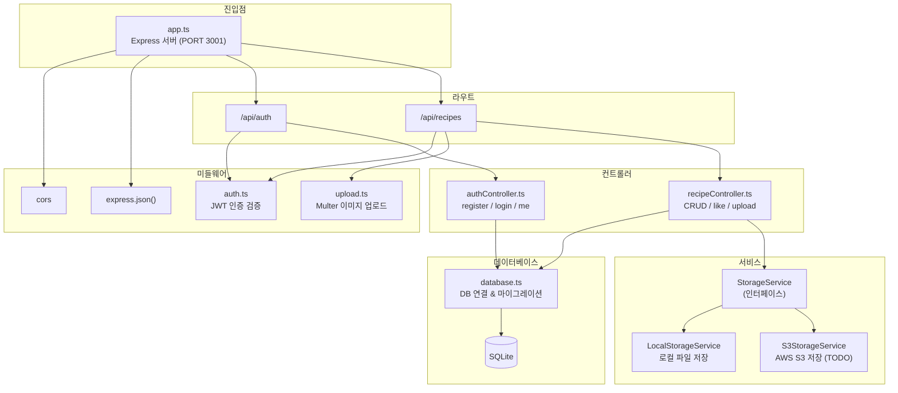
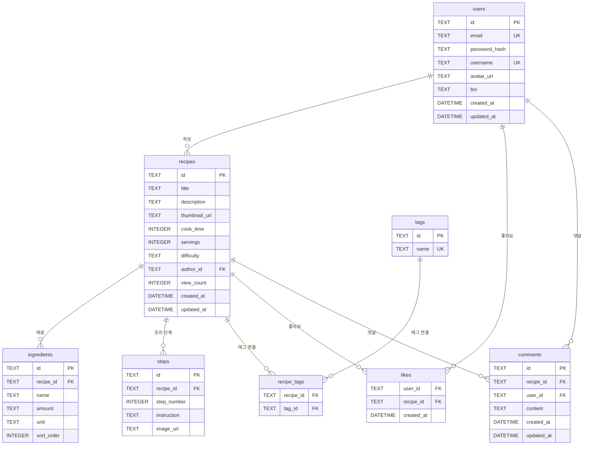
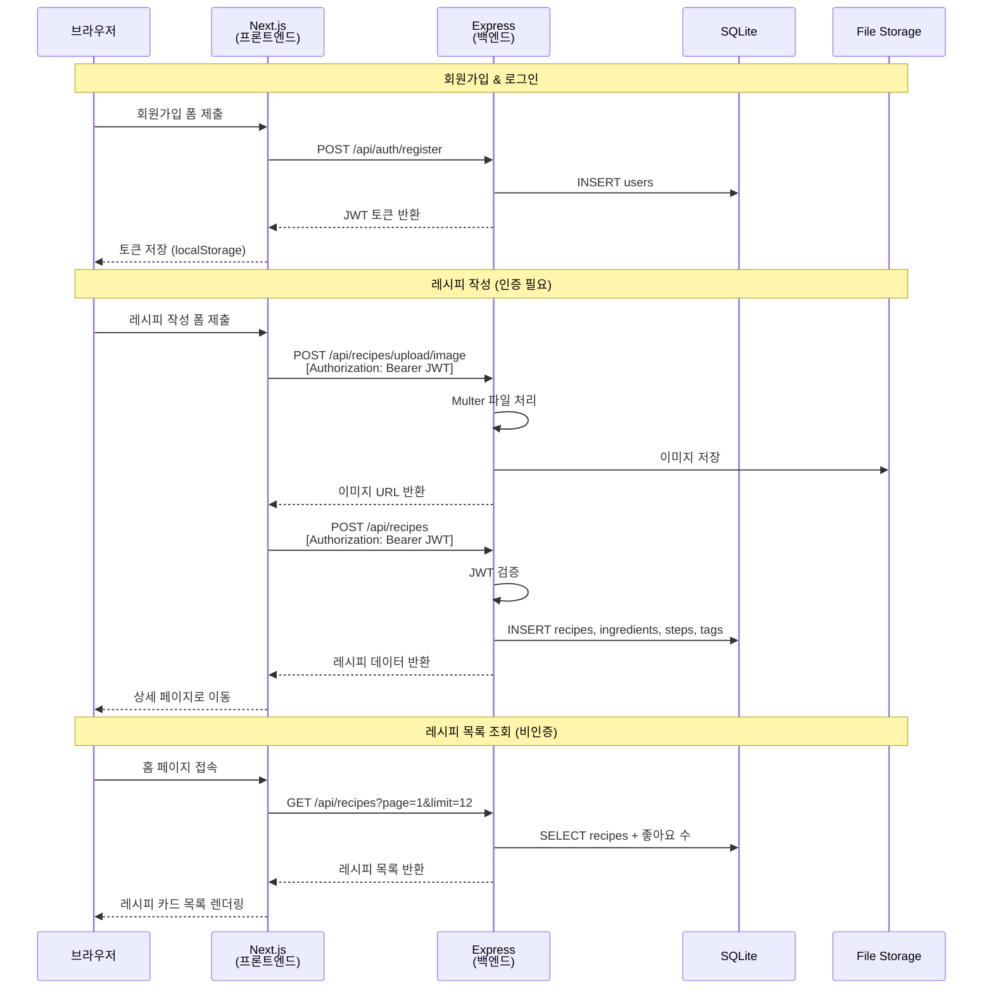
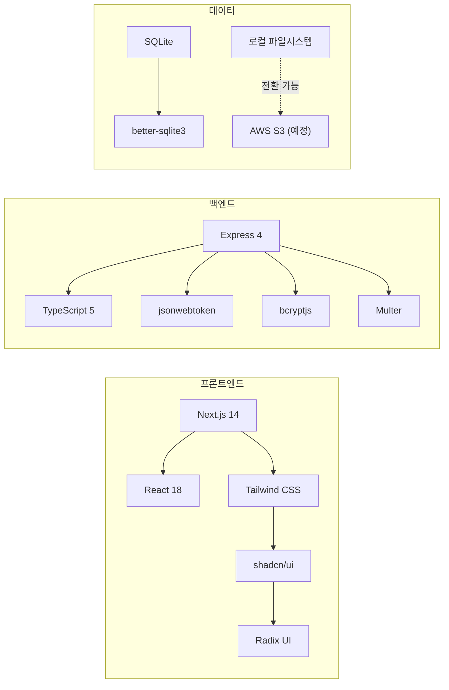

# CookShare 아키텍처 다이어그램

## 1. 시스템 전체 구조

## 2. 프론트엔드 구조

## 3. 백엔드 구조

## 4. 데이터베이스 ERD

## 5. API 요청 흐름

## 6. 기술 스택 요약

---

## 다이어그램 목차

| # | 다이어그램 | 유형 | 설명 |
|---|-----------|------|------|
| 1 | 시스템 전체 구조 | `graph TB` | 클라이언트 → 프론트엔드 → 백엔드 → DB 4계층 아키텍처 전체 흐름 |
| 2 | 프론트엔드 구조 | `graph LR` | App Router 페이지, shadcn/ui 컴포넌트, AuthContext 상태 관리 구성 |
| 3 | 백엔드 구조 | `graph TD` | Express 미들웨어 → 라우트 → 컨트롤러 → 서비스 → DB 레이어 흐름 |
| 4 | 데이터베이스 ERD | `erDiagram` | 8개 테이블(users, recipes, ingredients, steps, tags, recipe_tags, likes, comments) 간 관계 |
| 5 | API 요청 흐름 | `sequenceDiagram` | 회원가입, 레시피 작성, 목록 조회 3가지 시나리오의 요청-응답 시퀀스 |
| 6 | 기술 스택 요약 | `graph LR` | 프론트엔드 / 백엔드 / 데이터 레이어별 사용 기술 및 의존 관계 |
