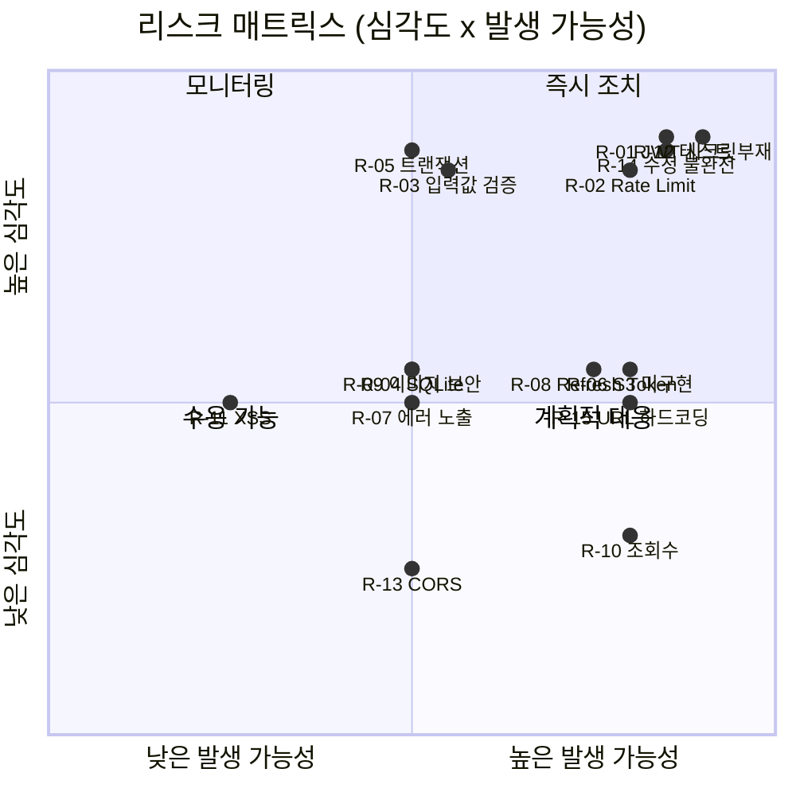
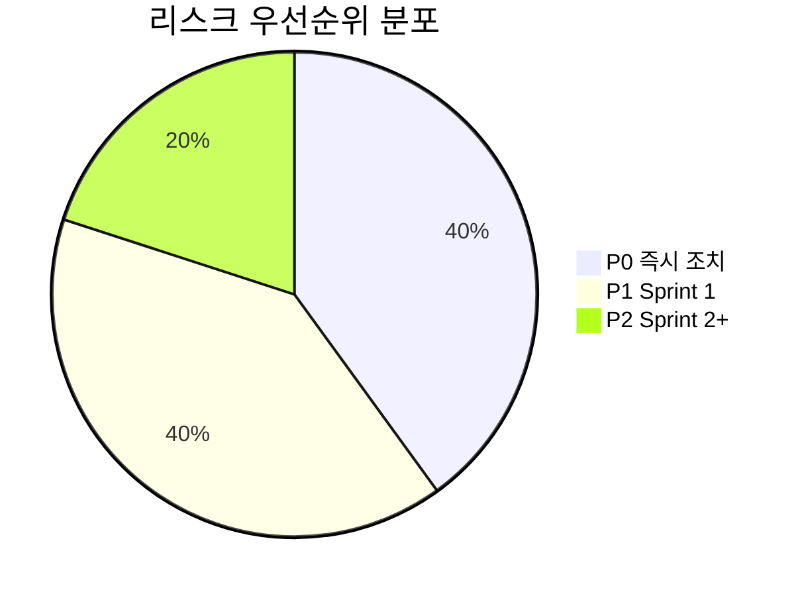

# CookShare 리스크 분석 보고서

> 분석일: 2026-02-18
> 분석 대상: MVP_SPEC.md, ARCHITECTURE.md, 소스코드 전체

---

## 1. 리스크 요약 매트릭스

| # | 리스크 | 영역 | 심각도 | 발생 가능성 | 우선순위 |
|---|--------|------|--------|-------------|----------|
| R-01 | JWT 시크릿 하드코딩 기본값 | 보안 | 🔴 높음 | 🔴 높음 | **P0** |
| R-02 | Rate Limiting 미적용 | 보안 | 🔴 높음 | 🔴 높음 | **P0** |
| R-03 | 입력값 검증(Validation) 미흡 | 보안 | 🔴 높음 | 🟡 중간 | **P0** |
| R-04 | SQLite 동시성 한계 | 확장성 | 🟡 중간 | 🟡 중간 | **P1** |
| R-05 | 트랜잭션 미사용 | 데이터 무결성 | 🔴 높음 | 🟡 중간 | **P0** |
| R-06 | S3 스토리지 미구현 | 운영 | 🟡 중간 | 🔴 높음 | **P1** |
| R-07 | 에러 메시지에 내부 정보 노출 | 보안 | 🟡 중간 | 🟡 중간 | **P1** |
| R-08 | 토큰 갱신(Refresh) 메커니즘 부재 | 인증 | 🟡 중간 | 🔴 높음 | **P1** |
| R-09 | 이미지 업로드 보안 취약점 | 보안 | 🟡 중간 | 🟡 중간 | **P1** |
| R-10 | 조회 수 조작 가능 | 비즈니스 로직 | 🟢 낮음 | 🔴 높음 | **P2** |
| R-11 | 프론트엔드 XSS 리스크 | 보안 | 🟡 중간 | 🟢 낮음 | **P2** |
| R-12 | 테스트 코드 부재 | 품질 | 🔴 높음 | 🔴 높음 | **P0** |
| R-13 | CORS 설정 단일 오리진 | 운영 | 🟢 낮음 | 🟡 중간 | **P2** |
| R-14 | 레시피 수정 시 재료·단계 미갱신 | 데이터 무결성 | 🔴 높음 | 🔴 높음 | **P0** |
| R-15 | 로컬 이미지 URL 하드코딩 | 운영 | 🟡 중간 | 🔴 높음 | **P1** |

---

## 2. 상세 분석

### R-01 JWT 시크릿 하드코딩 기본값 🔴 P0

**위치**: `backend/src/middleware/auth.ts:9`

```typescript
const JWT_SECRET = process.env.JWT_SECRET || 'dev-secret-change-in-production';
```

**리스크**: `.env` 미설정 시 모든 환경에서 동일한 시크릿이 사용되어 토큰 위조가 가능하다.

**권장 조치**:
- 프로덕션 환경에서 `JWT_SECRET` 미설정 시 서버 시작을 차단한다.
- 시크릿 길이를 최소 256비트(32자) 이상 강제한다.

---

### R-02 Rate Limiting 미적용 🔴 P0

**위치**: `backend/src/app.ts` (전체)

**리스크**: 인증 엔드포인트(`/api/auth/login`, `/api/auth/register`)에 요청 제한이 없어 브루트포스 공격에 취약하다.

**권장 조치**:
- `express-rate-limit` 도입 (로그인: 5회/분, 회원가입: 3회/분, 일반 API: 100회/분)
- 반복 실패 시 계정 잠금 또는 지연 응답 적용

---

### R-03 입력값 검증(Validation) 미흡 🔴 P0

**위치**: `backend/src/controllers/authController.ts`, `recipeController.ts`

**리스크**:
- 이메일 형식 검증 없음 — 잘못된 이메일로 가입 가능
- 사용자명 길이·형식 제한 없음 — 빈 문자열, 특수문자, 극단적 길이 허용
- 레시피 필드 `cook_time`, `servings`에 음수·극단값 검증 없음
- `difficulty` 값은 DB CHECK 제약만 의존 (애플리케이션 레벨 검증 없음)

**권장 조치**:
- `zod` 또는 `joi`로 요청 바디 스키마 검증 계층 도입
- 공통 validation 미들웨어 적용

---

### R-04 SQLite 동시성 한계 🟡 P1

**위치**: `backend/src/db/database.ts`

**리스크**: SQLite는 쓰기 잠금(write lock) 기반으로 동시 쓰기 요청이 많아지면 `SQLITE_BUSY` 에러 발생. WAL 모드가 적용되어 있으나, 사용자 수 증가 시 병목 발생.

**권장 조치**:
- MVP 단계에서는 허용 가능 (동시 사용자 ~100명 이하)
- 성장 단계에서 PostgreSQL 마이그레이션 계획 수립 (README에 언급됨)
- `busy_timeout` pragma 추가로 일시적 충돌 완화

---

### R-05 트랜잭션 미사용 🔴 P0

**위치**: `backend/src/controllers/recipeController.ts:79-110`

```typescript
// createRecipe: INSERT recipes → INSERT ingredients → INSERT steps → INSERT tags
// 4개 테이블에 순차 삽입하지만 트랜잭션으로 묶지 않음
```

**리스크**: 레시피 생성 중 중간 단계에서 실패하면 불완전한 데이터가 DB에 남는다. (예: 레시피는 생성되었으나 재료가 없는 상태)

**권장 조치**:
```typescript
const tx = db.transaction(() => {
  // INSERT recipes, ingredients, steps, tags
});
tx();
```
- `better-sqlite3`의 `transaction()` 메서드로 원자적 실행 보장

---

### R-06 S3 스토리지 미구현 🟡 P1

**위치**: `backend/src/services/storage/S3StorageService.ts`

**리스크**:
- `upload()`, `delete()` 모두 `throw new Error` 상태
- 프로덕션 배포 시 로컬 파일시스템 사용은 서버 재시작/스케일아웃 시 이미지 유실
- 다중 서버 환경에서 이미지 공유 불가

**권장 조치**:
- Sprint 1 완료 전까지 S3 구현 필수
- CDN(CloudFront) 연동 계획 포함

---

### R-07 에러 메시지에 내부 정보 노출 🟡 P1

**위치**: `backend/src/app.ts:32-35`

```typescript
res.status(500).json({ error: err.message || 'Internal Server Error' });
```

**리스크**: `err.message`에 DB 스키마, 파일 경로 등 내부 정보가 포함될 수 있다.

**권장 조치**:
- 프로덕션 환경에서는 항상 일반적 에러 메시지만 반환
- 상세 에러는 서버 로그에만 기록

---

### R-08 토큰 갱신(Refresh) 메커니즘 부재 🟡 P1

**위치**: `backend/src/middleware/auth.ts`

**리스크**:
- JWT 만료 시간 7일 — 토큰 탈취 시 7일간 악용 가능
- Refresh Token 없음 — 만료 후 재로그인 필요 (UX 저하)
- 토큰 폐기(revoke) 불가 — 비밀번호 변경/로그아웃 후에도 기존 토큰 유효

**권장 조치**:
- Access Token (15분) + Refresh Token (7일) 이중 토큰 구조 도입
- 토큰 블랙리스트 또는 DB 기반 세션 검증 추가

---

### R-09 이미지 업로드 보안 취약점 🟡 P1

**위치**: `backend/src/middleware/upload.ts`

**리스크**:
- MIME 타입만 검증 — 확장자 변조로 악성 파일 업로드 가능 (예: `.exe` → `.jpg`)
- 이미지 리사이징/정규화 없음 — 원본 그대로 저장되어 Exif 메타데이터(GPS 좌표 등) 노출
- 업로드 디렉토리 경로 조작 검증 없음

**권장 조치**:
- 파일 매직 바이트(file signature) 추가 검증
- `sharp` 라이브러리로 이미지 리사이징 + 메타데이터 제거
- 업로드 파일명에 사용자 입력값 제외 (현재 UUID 사용 — 양호)

---

### R-10 조회 수 조작 가능 🟢 P2

**위치**: `backend/src/controllers/recipeController.ts:70`

```typescript
db.prepare('UPDATE recipes SET view_count = view_count + 1 WHERE id = ?').run(id);
```

**리스크**: 상세 조회 API 호출마다 무조건 +1 — 봇이나 새로고침으로 조회 수 무한 증가 가능.

**권장 조치**:
- IP 또는 사용자 기반 중복 조회 방지 (1시간 내 동일 IP 중복 카운트 제외)
- Redis 기반 조회 수 버퍼링

---

### R-11 프론트엔드 XSS 리스크 🟡 P2

**위치**: 프론트엔드 전체

**리스크**: React의 JSX가 기본적으로 이스케이프하지만, `dangerouslySetInnerHTML` 사용 시 또는 레시피 본문에 마크다운/HTML을 허용할 경우 XSS 가능.

**권장 조치**:
- 사용자 입력 렌더링 시 항상 텍스트로 처리
- 마크다운 지원 시 `DOMPurify`로 sanitize

---

### R-12 테스트 코드 부재 🔴 P0

**위치**: 프로젝트 전체

**리스크**:
- 단위 테스트, 통합 테스트, E2E 테스트 모두 없음
- 리팩토링 및 기능 추가 시 회귀 버그 발견 불가
- CI/CD 파이프라인 품질 게이트 없음

**권장 조치**:
- 백엔드: `vitest` + `supertest`로 API 통합 테스트 우선 작성
- 프론트엔드: `jest` + `React Testing Library`로 핵심 컴포넌트 테스트
- 최소 커버리지 목표: 주요 API 엔드포인트 80% 이상

---

### R-13 CORS 설정 단일 오리진 🟢 P2

**위치**: `backend/src/app.ts:13`

```typescript
app.use(cors({ origin: process.env.CORS_ORIGIN || 'http://localhost:3000', credentials: true }));
```

**리스크**: 단일 오리진만 허용 — 스테이징/프리뷰 환경 추가 시 설정 변경 필요.

**권장 조치**:
- 다중 오리진 배열 또는 정규식 패턴 지원
- 환경별 CORS 설정 분리

---

### R-14 레시피 수정 시 재료·단계 미갱신 🔴 P0

**위치**: `backend/src/controllers/recipeController.ts:112-129`

```typescript
// updateRecipe: recipes 테이블만 UPDATE
// ingredients, steps, tags는 수정하지 않음
```

**리스크**: 레시피 수정 API가 기본 필드(title, description 등)만 업데이트하고, 재료·단계·태그는 갱신하지 않는다. MVP 명세서(US-06)의 인수 조건 "재료·단계·태그 모두 수정 가능"을 충족하지 못한다.

**권장 조치**:
- 수정 시 기존 재료·단계·태그를 DELETE 후 재삽입 (트랜잭션 내에서)
- 또는 개별 항목 PATCH API 추가

---

### R-15 로컬 이미지 URL 하드코딩 🟡 P1

**위치**: `backend/src/services/storage/LocalStorageService.ts:11`

```typescript
this.baseUrl = `http://localhost:${process.env.PORT || 4000}`;
```

**리스크**: 이미지 URL이 `http://localhost:4000/uploads/...`로 DB에 저장된다. 프로덕션 배포 시 모든 기존 이미지 URL이 깨진다.

**권장 조치**:
- `BASE_URL` 환경 변수로 분리
- DB에는 상대 경로(key)만 저장하고, URL은 응답 시 동적 생성

---

## 3. 리스크 우선순위별 액션 플랜

### P0 — 즉시 조치 (출시 전 필수)

| # | 리스크 | 액션 | 예상 공수 |
|---|--------|------|-----------|
| R-01 | JWT 시크릿 하드코딩 | 프로덕션 시작 시 환경변수 필수 검증 추가 | 0.5h |
| R-02 | Rate Limiting 미적용 | `express-rate-limit` 미들웨어 추가 | 1h |
| R-03 | 입력값 검증 미흡 | `zod` 스키마 검증 도입 | 3h |
| R-05 | 트랜잭션 미사용 | `createRecipe`에 `db.transaction()` 적용 | 1h |
| R-12 | 테스트 코드 부재 | 핵심 API 통합 테스트 작성 | 8h |
| R-14 | 레시피 수정 불완전 | 재료·단계·태그 갱신 로직 구현 | 2h |

### P1 — Sprint 1 내 조치

| # | 리스크 | 액션 | 예상 공수 |
|---|--------|------|-----------|
| R-04 | SQLite 동시성 | `busy_timeout` 추가 + PostgreSQL 마이그레이션 계획 | 1h |
| R-06 | S3 미구현 | `@aws-sdk/client-s3` 기반 구현 | 4h |
| R-07 | 에러 정보 노출 | 프로덕션 에러 핸들러 분리 | 1h |
| R-08 | Refresh Token 부재 | 이중 토큰 구조 도입 | 4h |
| R-09 | 이미지 업로드 보안 | 매직 바이트 검증 + `sharp` 리사이징 | 2h |
| R-15 | 이미지 URL 하드코딩 | `BASE_URL` 환경변수 분리 + 상대경로 저장 | 2h |

### P2 — Sprint 2 이후 조치

| # | 리스크 | 액션 | 예상 공수 |
|---|--------|------|-----------|
| R-10 | 조회 수 조작 | IP 기반 중복 방지 로직 | 2h |
| R-11 | XSS 리스크 | 사용자 입력 sanitize 확인 | 1h |
| R-13 | CORS 단일 오리진 | 다중 오리진 지원 | 0.5h |

---

## 4. 리스크 분포 시각화




